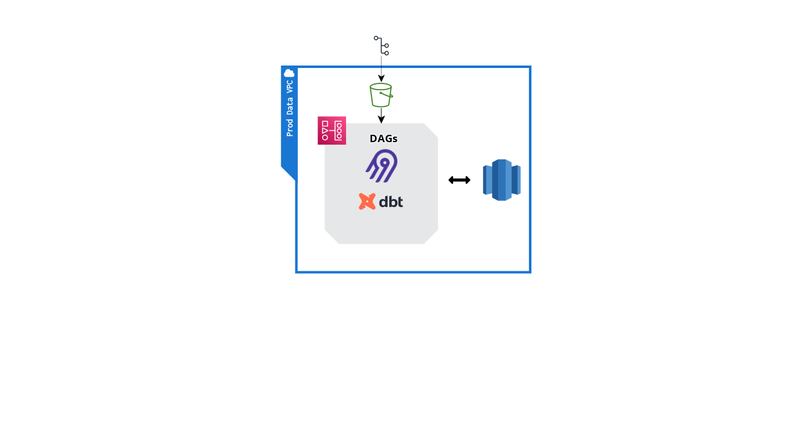
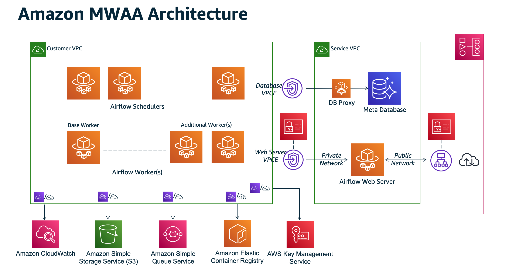

## General Structure

My idea for the architecture for the data stack is as below

Where the DAGs are controlled and scheduled by an instance of Airflow running inside Managed Workflow Apache Airflow, an Amazon managed service.

The structure for MWAA is as below, I've also included the [terraform](mwaa-prod.tf) code that could be (tweaked and) used to deploy this environment.

As can be seen from the above diagram, MWAA manages logging to CloudWatch and SQS for status notifications.

## dbt Deployment

As I see it, there are two significantly different ways to deploy dbt when using MWAA. 

The first, I think, is the simpler of the two, which is to simply bootstrap the MWAA cluster with `dbt-core` and using the BashOperator or KubernetesPodOperator to run the dbt jobs.

Where we use the MWAA standard S3 bucket in combination with github actions (for example) as version control for the dbt models.

Using Airflow to manage the dbt models through DAGs in the MWAA mean that there is less to worry about in terms of explicit resource management. However, there may need to be extra steps taken through documentation of the DAGs to ensure that it's clear what each dbt DAG is actually doing in the Airflow UI.

Making use of dbt cloud is an alternative to this approach, but given what I know about the requirements for this infrastructure, using dbt in Airflow is sufficient. 

I'd reconsider my opinion based on the number of non-technical users that are expected to be interacting with and updating dbt models, since this approach does require some python boilerplate and knowledge of version control that could prove to be an obstacle for those who don't regularly work with them.

